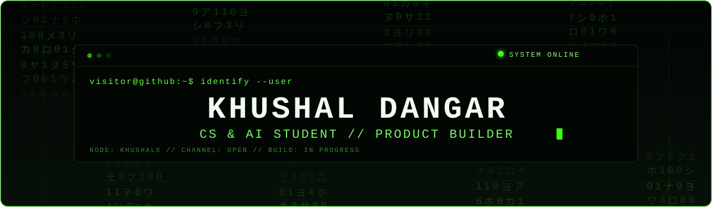

  

  <code>visitor@github:~$ whoami</code> 
  <strong>Khushal Dangar</strong> 
  CS &amp; AI Student 
  Developer • Builder • Problem Solver
    
  <code>visitor@github:~$ status</code> 
  Building ideas into working products.

  <picture>
    <source media="(prefers-reduced-motion: reduce)" srcset="https://img.shields.io/badge/CS_%26_AI_Student-050805?style=flat-square&amp;labelColor=050805&amp;color=050805">
    
  </picture>

  
  

---

